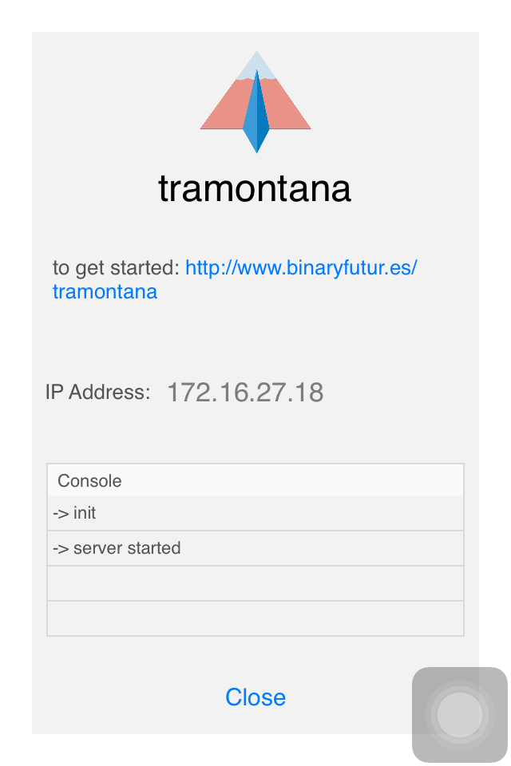

ofxTramontana
=====================================

Introduction
------------

A prototyping kit for iOS.

Tramonatana is a platform intended as a tool for designers and creatives to use iPhones and iPads as sensors or actuators and create quick prototypes of interactive apps, spaces and objects.

With this openFrameworks plugin you can control from a desktop sketch your phone and you can use it as a sensor or actuator with little effort. You can download the iOS app [here](https://itunes.apple.com/us/app/tramontana/id1121069555?ls=1&mt=8).

Getting started
------------

In your header file import "ofxTramonatana.h".

~~~~ 
#include "ofxTramontana.h"
....
ofxTramontanaIOS iphone;
~~~~ 
To communicate with iPhones or iPads the class you want to instantiate is _ofxTramontanaIOS_.

To start communicating with your device:

~~~~ 
iphone.start("192.168.1.2");
~~~~ 

You can find the IP Address to give as argument in the landing view on your Tramontana App: 

License
-------
Released under [MIT License](https://en.wikipedia.org/wiki/MIT_License), check `license.md` for more info.

Installation
------------
Clone the repo in the `openFrameworks/addons/` folder.

Dependencies
------------
[ofxLibWebSocket](https://github.com/robotconscience/ofxLibwebsockets)

Compatibility
------------
Tested with OS X and OF 0.9.3

